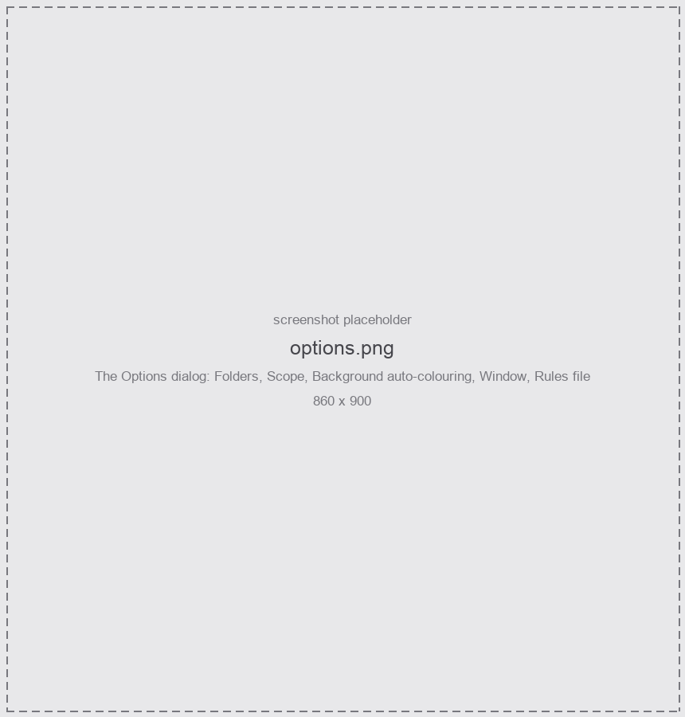

Everything that is not a rule lives in **Options**, on the right-hand end of the action bar. The
settings are global — one rule set, one set of options, shared by every project.

<figure class="shot">

<figcaption>Options</figcaption>
</figure>

## Folders

How a folder's colour reaches its children. See
[Folder colours](/Reaper-AutoColor/usage/items-and-folders/#folder-colours).

| Setting | Meaning |
|---|---|
| **fill gaps** *(default)* | Children with no rule of their own inherit. |
| **force** | The folder colour overrides its children. |
| **off** | Folders do not colour their children. |

## Scope

**Reset to the default colour when no rule matches**, one checkbox per kind — Tracks, Items, Regions,
Markers. Off everywhere by default. See
[Reset unmatched objects](/Reaper-AutoColor/usage/clearing/#reset-unmatched-objects).

:::tip
Recommended for **items**, where it makes an item follow its track live. Careful on **tracks**,
where it also strips colours you set by hand.
:::

## Background auto-colouring

| Setting | Default | What it does |
|---|---|---|
| **Create undo points for automatic changes** | off | An undo point per automatic recolour. Off because renaming a track would otherwise shred your undo history, and the colours can always be re-derived from the rules. |
| **Check every (s)** | 0.20 | How often the loop wakes. |
| **Work budget (ms)** | 4 | How long it may work before yielding back to REAPER. |
| **Rescan items at most every (s)** | 5 | The delay before an item *renamed in place* is noticed. `0` re-reads everything on every change. |

[Auto-apply](/Reaper-AutoColor/usage/auto-apply/) explains what the loop re-reads and why the rescan
interval exists.

## Window

**Text size** — 8 to 32. Every dimension in the window is a multiple of the font size, so this
scales the whole layout rather than just the labels.

## Rules file

Shows the path to [`config.json`](/Reaper-AutoColor/configuration/rules-file/), and offers **Replace with
the starter rules…** — the built-in starter set, as written on first run. It asks for confirmation,
and the **Undo** button takes it back while the window is open.

## Where to go next

- [Rules file](/Reaper-AutoColor/configuration/rules-file/) — what is stored, where, and what happens when it goes wrong.
- [REAPER preferences](/Reaper-AutoColor/configuration/reaper-preferences/) — two settings outside this tool that decide what you see.
