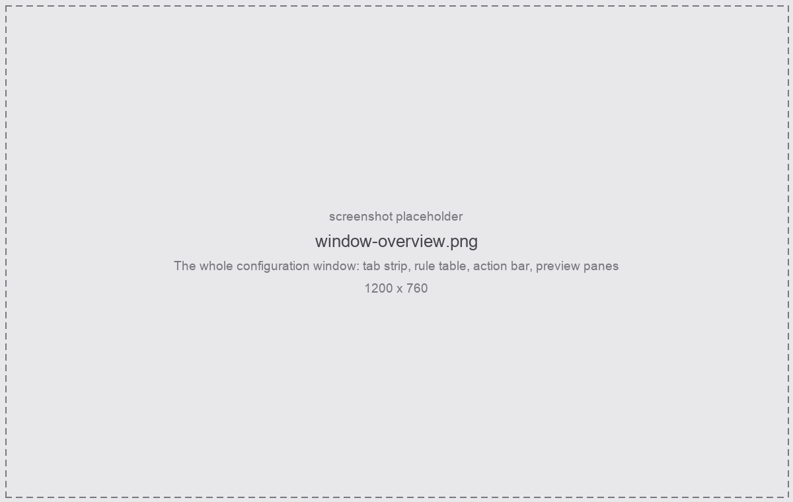

AutoColor colours **tracks, items, regions and markers** in REAPER from their **names**, using
plain substring, glob, or **real regular expressions**.

Write the rules once and every project follows them: a track called `Sub Bass DI` goes purple the
moment it is named, and the items on it go with it.

<figure class="shot">

<figcaption>The configuration window</figcaption>
</figure>

## Main features

- **One ordered list per object kind** — Tracks, Items, Regions and Markers each have their own
  tab, and within a tab the **first rule that matches wins**, exactly like firewall rules.
- **Three match modes** — `contains`, `glob` and full `regex`, per rule.
- **Non-name filters** — narrow a rule to folder tracks, tracks inside a folder, or unnamed
  objects.
- **Gradients** — give a rule a second colour and its matches are spread along a ramp, grouped by
  runs, folders, or not at all.
- **Items follow their track** — a track rule can colour the items sitting on it, whatever those
  items are called.
- **Background auto-colouring** — a loop that keeps the project in step as you rename, without
  adding undo points and without ever reverting a colour you set by hand.
- **Live preview** — every rule shows its hit count, and the panes at the foot of the window list
  the objects it actually claims in this project.

:::tip[SWS Auto Color]
SWS matches case-insensitive substrings only, and has no item support. If you are coming from it,
[Matching names](/Reaper-AutoColor/usage/matching/) covers what the three modes do differently. Do not
run both at once — see [Troubleshooting](/Reaper-AutoColor/troubleshooting/).
:::

## How a colour is decided

1. The object's name is tested against the rules on **its own tab**, top to bottom.
1. The **first** rule that matches wins; its colour is the object's colour.
1. If that rule has a second colour, the object's shade comes from where it sits in its
   [gradient group](/Reaper-AutoColor/usage/colours/#gradients).
1. An item that no item rule claims can still take its **track's** colour, if the track's rule says
   to [cascade](/Reaper-AutoColor/usage/items-and-folders/).
1. A track that no rule claims can still inherit from its **folder parent**, depending on the
   [folder setting](/Reaper-AutoColor/usage/items-and-folders/#folder-colours).
1. If nothing claims it, the object is left alone — unless you asked for unmatched objects of that
   kind to be [reset](/Reaper-AutoColor/usage/clearing/#reset-unmatched-objects).

Nothing is written to the project until you **Apply** or the background loop runs.

## Where to go next

- [Installation](/Reaper-AutoColor/installation/) — install through ReaPack, or copy the folder in by hand.
- [The configuration window](/Reaper-AutoColor/usage/) — the tabs, the rule row, the action bar.
- [Matching names](/Reaper-AutoColor/usage/matching/) — modes, supported regex, filters.
- [Auto-apply](/Reaper-AutoColor/usage/auto-apply/) — the background loop and what it refuses to touch.
- [Troubleshooting](/Reaper-AutoColor/troubleshooting/) — when the colour is not what you expected.
