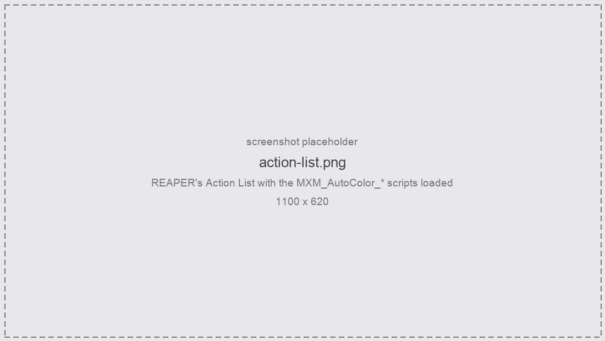
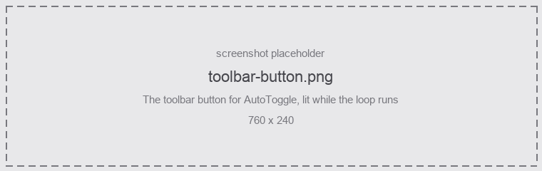

## Requirements

| | |
|---|---|
| REAPER | **7**, tested against 7.80 on macOS/arm64 |
| ReaImGui | **0.10 or later** — for the configuration window only |

Everything except the window works without ReaImGui: the apply, clear and auto-colour actions are
plain ReaScript.

Install ReaImGui from *Extensions → ReaPack → Browse packages*, search `ReaImGui`, **Install**,
then restart REAPER.

:::note
ReaImGui lives at [codeberg.org/cfillion/reaimgui](https://codeberg.org/cfillion/reaimgui). The
GitHub repository was archived in June 2026 and is now a stale mirror — do not install from it.
:::

## Install with ReaPack

The easy way, and the one that keeps itself up to date. Import the repository once:

```
https://github.com/michal-bartak/ReaPack/raw/main/index.xml
```

In REAPER: *Extensions → ReaPack → Import repositories*, paste that URL, then open
*Extensions → ReaPack → Browse packages*, find **AutoColor** and install it.

Every action in the table below is added to the Action List for you, the
[toolbar icon](#the-toolbar-icon) arrives with it, and updates come through ReaPack from
then on.

## Install by hand

If you would rather not use ReaPack, the repository's `Reaper/` folder mirrors REAPER's own
resource path, so installing is one copy.

1. Open *Options → Show REAPER resource path in explorer/finder*. That is the folder everything
   below goes into:

   | OS | Resource path |
   |----|------|
   | macOS | `~/Library/Application Support/REAPER/` |
   | Windows | `%AppData%\REAPER\` |
   | Linux | `~/.config/REAPER/` |

1. Copy the **contents** of `Reaper/` over it, merging with what is already there:

   ```
   Reaper/Scripts/MXM_AutoColor/  ->  <resource path>/Scripts/MXM_AutoColor/
   Reaper/Data/toolbar_icons/         ->  <resource path>/Data/toolbar_icons/
   ```

   The scripts and the [toolbar icon](#the-toolbar-icon) land in the right places together.

1. In REAPER, open *Actions → Show action list → New action → Load ReaScript*, and load the
   scripts you want from the table below. They are in `Scripts/MXM_AutoColor/`.

<figure class="shot">



<figcaption>The Action List with the scripts loaded</figcaption>
</figure>

## The actions

| Script | What it does | In the Action List |
|---|---|---|
| `MXM_AutoColor_GUI.lua` | The configuration window | added for you |
| `MXM_AutoColor_ApplyAll.lua` | Colour the whole project, one undo point | add it yourself |
| `MXM_AutoColor_ApplySelection.lua` | Colour the selected tracks and items | add it yourself |
| `MXM_AutoColor_ClearColors.lua` | Reset colours to the theme default | add it yourself |
| `MXM_AutoColor_AutoToggle.lua` | Start/stop background auto-colouring | added for you |
| `MXM_AutoColor_WhyThisColour.lua` | Explain the colour on the selected track or item | add it yourself |
| `MXM_AutoColor_Dump.lua` | Read-only diagnostic listing | add it yourself |
| `MXM_AutoColor_RunTests.lua` | Self-test, prints to the ReaScript console | add it yourself |

Installing adds only `GUI` and `AutoToggle` to the Action List, which is all most setups need. The
rest are installed alongside them but left out of the list, so it does not fill up with entries you
will never run. Add any of them whenever you want a keyboard shortcut, or to diagnose a colour that
looks wrong: *Actions → Show action list → New action → Load ReaScript*, then pick the file from
`Scripts/MXM Scripts/Color/MXM_AutoColor/`.

:::tip[Toolbar buttons]
Right-click a toolbar → *Customize toolbar…* → **Add**, and pick the action. `AutoToggle` reports
its state back, so its button lights while the background loop is running.
:::

### The toolbar icon

An icon for the configuration-window button comes with the scripts — copying `Reaper/` over the
resource path already put it in place:

```
<resource path>/Data/toolbar_icons/mxm_toolbar_autocolor.png        90x30
<resource path>/Data/toolbar_icons/150/mxm_toolbar_autocolor.png    135x45
<resource path>/Data/toolbar_icons/200/mxm_toolbar_autocolor.png    180x60
```

It is in REAPER's own toolbar format: a three-state strip of square cells — normal, hover, pressed.
The `150` and `200` copies are what REAPER reaches for on a hi-DPI display, and it finds them by the
**same filename** in those subfolders, so do not rename them.

To use it: restart REAPER, right-click the toolbar → *Customize toolbar…*, select the
`MXM_AutoColor_GUI.lua` button, and pick the icon from REAPER's icon browser.

:::note[What the states look like]
Hovering rotates the star's colours one step around the ring; pressing rotates them two. REAPER's
own icons instead lighten on hover, which on a six-colour mark reads as a white film laid over it
rather than as a highlight.

REAPER also brightens the **button plate behind** the icon on hover, and turns it the theme's
accent colour while a toggle action is armed. That comes from the theme, not from the icon, and
applies to every button on the toolbar.
:::

<figure class="shot">



<figcaption>The AutoToggle toolbar button, lit while the loop runs</figcaption>
</figure>

## First run

Run `MXM_AutoColor_GUI.lua`. On the very first run it writes a **starter rule set** so the window
has something to show, and tells you where:

```
<REAPER resource path>/MXM_AutoColor/config.json
```

That file is one global rule set shared by every project, and it sits **outside** `Scripts/` on
purpose — reinstalling or updating the scripts cannot destroy your rules. See
[Rules file](/Reaper-AutoColor/configuration/rules-file/).

:::caution[Editing the scripts]
The window and the auto-toggle hold their Lua state for as long as they run. If you edit anything
under `Scripts/MXM_AutoColor/lib/`, close the window and re-run it, and toggle auto off and on
again — otherwise the old code is still the code that is running. One-shot actions pick up changes
immediately.
:::

## Upgrading from the single-list version

Older configurations kept **one** rule list, where each rule carried track/item/region/marker
checkboxes. They are migrated on first load: a rule that ticked several boxes becomes one rule **per
tab**, in the same relative order, so the precedence you had is preserved within every kind. Nothing
is lost, and the previous file is kept as `config.bak.json`.

After migrating you may find duplicate rules on the **Items** tab — copies of track rules that
happened to match item *names*. If what you actually wanted was "colour the items on these tracks",
delete the copies and tick [also colour items](/Reaper-AutoColor/usage/items-and-folders/) on the track
rule instead.
