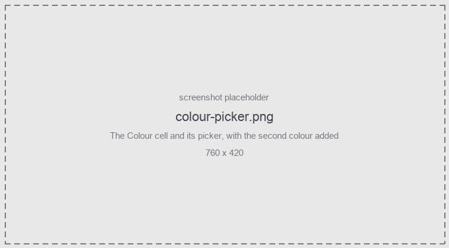
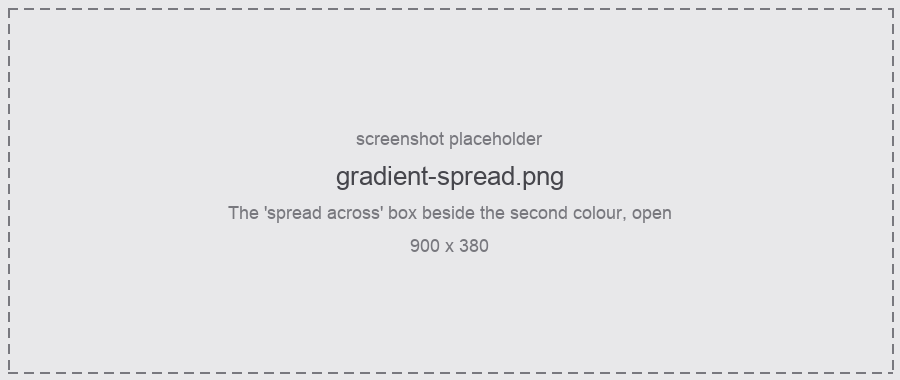
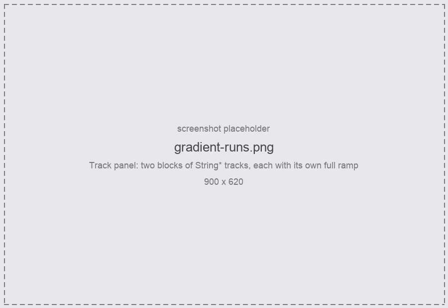

Each rule has a colour. The objects it wins get that colour, and that is the whole story until you
add a **second** colour.

<figure class="shot">



<figcaption>The Colour cell, with a second colour added</figcaption>
</figure>

## Gradients

With a second colour, the objects the rule wins are spread evenly along a ramp between the two, in
**project order**, separately per kind. Ten tracks matching one rule come out as ten shades rather
than ten identical swatches.

**What a ramp spreads across** is set per rule, in the box beside the second colour.

<figure class="shot">



<figcaption>Spread the gradient across:</figcaption>
</figure>

| Spread across | Meaning |
|---|---|
| **all matches** | One ramp across every match in the project. |
| **runs** | A run is an unbroken stretch this rule wins. Anything it does not win ends one — and so does a **visual spacer**. |
| **folders** | One ramp inside each folder. Tracks only. |
| **runs & folders** | A new ramp at a gap or a folder edge, whichever comes first. |

Tracks and items default to **runs**. Regions and markers default to **all matches**: a song's
regions are normally interleaved — `Verse, Chorus, Verse, Chorus` — so a rule matching one of them
rarely wins two in a row, and grouping would leave every group with a single member and no visible
gradient. Switch them to **runs** when your regions really do come in blocks.

### What counts as a break

With `String*` matching all of these, each block gets its own full ramp:

```
String1, String2, String3      <- "runs": the Bus below ends this one
Bus
String11, String12, String13

String1(parent), String2, String3       <- "folders"
String11(parent), String12, String13

String1, String2, String3
─────────────────────────      <- a visual spacer; also "runs"
String11, String12, String13
```

<figure class="shot">



<figcaption>Two runs, each with its own full ramp</figcaption>
</figure>

REAPER 7's **visual spacers** count as a break, so a gradient can be split without inventing a
separator track — *Track: Insert visual spacer before tracks*, and the ramp restarts there. That is
usually the tidiest way to say "these belong together and those don't", since the line is already
drawn in the track panel.

Items group **per track** as well as per gap: ramping a gradient across a track boundary is
meaningless, so for items "all matches" means every match on that track. Folders are offered for
track rules only — nothing else has folder structure.

### Two things to know

- Gradients are **position dependent**. Inserting an object into a group reshuffles that group.
  Grouping shrinks the blast radius — one group rather than every match — but each member then moves
  further, because the groups are smaller. Edits at a boundary change membership: renaming the
  separating `Bus` to `String Bus` merges two groups and recolours both.
- They cannot be computed incrementally, so a gradient rule aimed at **items** is expensive on very
  large projects.

:::caution[Two combinations flatten a gradient]
The rule warns about both, because each leaves every group with one member and so one colour:

- grouping by **folder** with an *is a folder track* filter;
- grouping by **folder** while folder colours are set to [force](/ReaColorizer/usage/items-and-folders/#folder-colours).
:::

## Where to go next

- [Items and folders](/ReaColorizer/usage/items-and-folders/) — cascading a colour to items and down a folder.
- [REAPER preferences](/ReaColorizer/configuration/reaper-preferences/) — two settings that decide whether these colours are visible at all.
