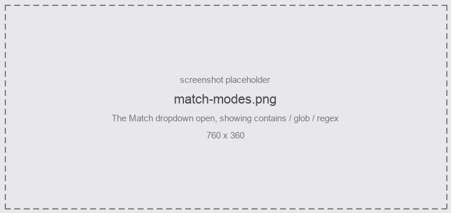
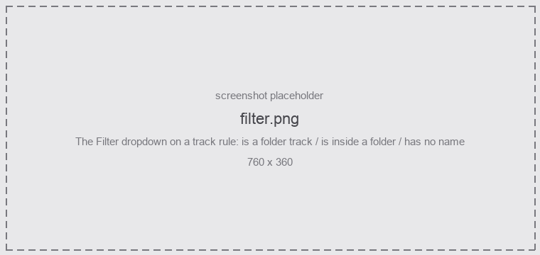

Every rule tests one thing: the object's **name**. How it tests it is the **Match** mode.

<figure class="shot">



<figcaption>The three match modes</figcaption>
</figure>

| Mode | Matches | Example |
|---|---|---|
| **contains** | anywhere in the name, nothing is interpreted | `bass` matches "Sub Bass DI" |
| **glob** | the **whole** name; `*` `?` `[abc]` `[!abc]` | `*bass*`, `Gtr_?`, `[Bb]ass*` |
| **regex** | anywhere, unless anchored | `^(kick\|snare\|hh)\b` |

:::caution[contains and glob are not the same thing]
`bass` as a **glob** matches only a track called exactly "bass", because globs are anchored to the
whole name. As **contains**, it matches "Sub Bass DI". If a glob rule is unexpectedly on 0 hits,
this is almost always why — wrap it in `*`.
:::

**Aa** on the row makes the comparison case-insensitive. It is **on** for a new rule — track names
get typed casually, and a rule that silently misses "Bass" because it was written `bass` is a bad
default. It folds **ASCII only**: it will not equate `Č` with `č`.

## Supported regex syntax

```
.                any character except newline (one whole UTF-8 character)
( )  (?: )       capturing / non-capturing group
|                alternation
* + ? {n} {n,} {n,m}     greedy; add ? for lazy (*? +? ??)
[abc] [^abc] [a-z]       character classes
\d \D \w \W \s \S        digit / word / space classes
\b \B            word boundary
^ $              start / end of the name
\n \t \r \xHH    escapes
(?i)             case-insensitive, at the very start only
```

Backreferences, lookaround and named groups are **not** supported. A pattern that uses them is
rejected with a message on the row, rather than silently misbehaving.

:::note[Non-ASCII names]
Byte classes accept non-ASCII, so `\w+` matches `Kytara_hlavní`. It is only case *folding* that is
ASCII-only.
:::

:::caution[Patterns that are too slow]
A pathological pattern — `(a+)+$` and friends — is cut off by a step budget rather than being
allowed to hang REAPER. The rule is flagged in the window when that happens and treated as a
no-match. Nested quantifiers are the usual cause; simplify the pattern.
:::

Use the **Pattern tester** at the foot of the window to work a pattern out before you commit it to a
rule. It has its own mode, pattern and name to try them on, shows where the match landed and what
each group captured, and touches neither your rules nor the project.

## Filters

A rule can carry one optional non-name filter that **narrows** what it matches.

<figure class="shot">



<figcaption>Filters on a track rule</figcaption>
</figure>

| Filter | Applies to | Matches |
|---|---|---|
| **is a folder track** | tracks | a track that is the parent of a folder |
| **is inside a folder** | tracks | any track nested under a folder parent |
| **has no name** | all kinds | an object with an empty name |

The filter and the pattern are combined with **and** — both must hold. Leave the **pattern** empty to
match on the filter alone: an empty pattern with *is a folder track* means "every folder track", and
`^Drums` with the same filter means "folder tracks named Drums…".

Filters a kind cannot use are not offered on that kind's tab, so you cannot build a rule that
silently never matches.

## A worked example

Rules on the **Tracks** tab, top to bottom:

| # | Name | Match | Pattern | Filter | Wins |
|---|---|---|---|---|---|
| 1 | Drum bus | regex | `^Drums$` | is a folder track | the folder parent only |
| 2 | Drums | regex | `^(kick\|snare\|hh)\b` | — | the drum tracks by name |
| 3 | Anything in a folder | contains | *(empty)* | is inside a folder | everything else nested |

Rule 3 has no pattern at all, so it would match every track were it not for the filter — and it sits
last, so it only ever gets what rules 1 and 2 did not claim. That is the normal shape: specific rules
at the top, a catch-all at the bottom.

## Where to go next

- [Colours and gradients](/ReaColorizer/usage/colours/) — what a matching rule then paints.
- [Items and folders](/ReaColorizer/usage/items-and-folders/) — the two ways an object gets a colour without matching a rule of its own.
